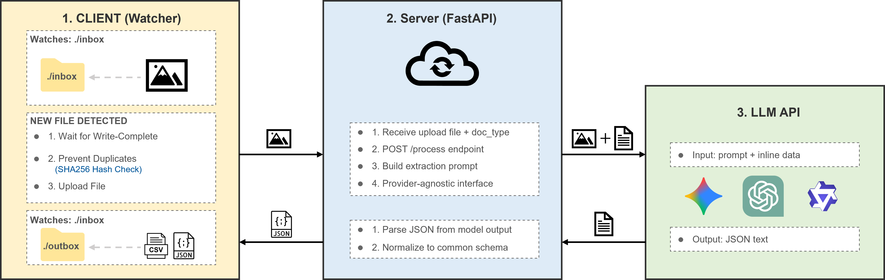

# Architecture

## Pipeline Flow

Client → Server → LLM → Structured Data

Flow:

1. Client watches a folder (`./inbox`)
2. When a new file appears:
   - Wait until the file is fully written
   - Prevent duplicates (SHA256)
   - Upload file to the server
3. Server:
   - Sends the document to Gemini API
   - Extracts structured information
4. Client stores the result in:
   - `outbox/results.jsonl`
   - `outbox/results.csv`